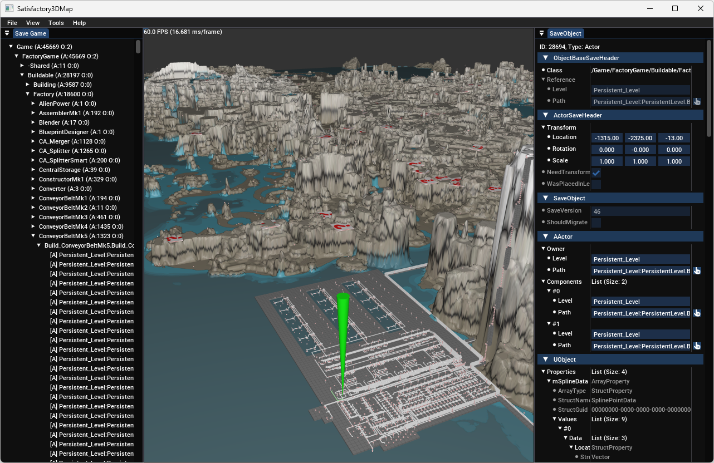

# Satisfactory 3D Map Save Editor

A 3D map save game editor for the game [Satisfactory](https://www.satisfactorygame.com/) by Coffee Stain Studios.
This tool allows the visualization of all objects contained in a save game in 3D space.
Object details are shown in a listing of all properties with the possibility to edit these values.

Downloads are available on the [Release Page](https://github.com/moritz-h/satisfactory-3d-map/releases).

Part of this project is an independent Satisfactory save game parsing library written in C++ with Python bindings.
For more information about the Python library, see the separate [Python Readme](libsavepy/README.md).
Further, a documentation of the save game format is available [here](docs/SATISFACTORY_SAVE.md).

## License

> Copyright (C) 2021 - 2025  Moritz Heinemann
>
> This program is free software: you can redistribute it and/or modify
> it under the terms of the GNU General Public License as published by
> the Free Software Foundation, either version 3 of the License, or
> (at your option) any later version.
>
> This program is distributed in the hope that it will be useful,
> but WITHOUT ANY WARRANTY; without even the implied warranty of
> MERCHANTABILITY or FITNESS FOR A PARTICULAR PURPOSE.  See the
> GNU General Public License for more details.
>
> You should have received a copy of the GNU General Public License
> along with this program.  If not, see <https://www.gnu.org/licenses/>.

The source code of Satisfactory3DMap itself is licensed under the GNU GPLv3.
In addition, this repository contains several files from different copyright holders, where other licenses may apply:

| Files                       | Copyright by                                               |
|-----------------------------|------------------------------------------------------------|
| map/resources/textures/Map/ | [Coffee Stain Studios](https://www.coffeestainstudios.com) |
| map/resources/fonts/        | [Font Awesome](https://fontawesome.com/)                   |
| cmake/deps/glad/            | [David Herberth](https://github.com/Dav1dde/glad)          |

During CMake build, the following additional libraries will be fetched and included:

- [CMakeRC](https://github.com/vector-of-bool/cmrc.git)
- [Dear ImGui](https://github.com/ocornut/imgui.git)
  - [imgui_club](https://github.com/ocornut/imgui_club.git)
- [FreeType](https://github.com/freetype/freetype.git)
- [GLFW](https://github.com/glfw/glfw.git)
- [GLM](https://github.com/g-truc/glm.git)
- [glOwl](https://github.com/invor/glowl.git)
- [IconFontCppHeaders](https://github.com/juliettef/IconFontCppHeaders.git)
- [JSON for Modern C++](https://github.com/nlohmann/json.git)
- [natsort](https://github.com/sourcefrog/natsort.git)
- [Portable File Dialogs](https://github.com/samhocevar/portable-file-dialogs.git)
- [pybind11](https://github.com/pybind/pybind11.git)
- [spdlog](https://github.com/gabime/spdlog.git)
- [TinyGLTF](https://github.com/syoyo/tinygltf.git)
- [ValveFileVDF](https://github.com/TinyTinni/ValveFileVDF.git)
- [zlib](https://github.com/madler/zlib.git)
